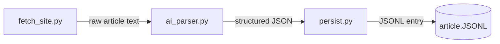

# AI Newsletter Automation (WIP)


AI Automation System will deliver a scalable, intelligence-driven pipeline that automatically sources, filters, summarises, and posts high-value tech news, events, and study/career resources directly to DSEC's communication channels. This system will operate alongside the website and Discord bot, becoming a core infrastructure pillar for DSEC's long-term digital presence.

## Setup

1. Install [Python](https://python.org) and [uv](https://docs.astral.sh/uv/getting-started/installation/)
2. Clone this repository

    ```bash
    git clone https://github.com/deakinSoftwareEngineeingClub/AI-scraper-newsletter
    ```

3. Create Virtual Environment and install project dependencies

    ```bash
    uv venv
    .venv/Scripts/Activate # Activate Virtual environment

    uv sync
    ```

4. Run project

You can run the project using either the command line or your IDE/editor.

**Option 1: Run as a module**
From the project root directory `AI-scraper-newsletter/`

````bash 
python -m app.main
````

OR

**Option 2: Run from your IDE/editor**
Open the project from the root directory `AI-scraper-newsletter/` with something like VS Code and run `main.py` located in `app/`
	

Note: 
If you want to install new dependencies:
**only works if you created a virtual environment from step 3**

```
uv add PYTHON_LIB_HERE
```

## How it works

The project works in three simple steps.

1. **Article extraction**
Each article is loaded using a headless browser to fully render dynamic content. Once loaded, all relevant textual content is extracted and non-content elements are discarded.

2. **LLM-based parsing and normalization**
The extracted text is passed to the selected large language model (Gemini), which parses the raw content into a structured JSON representation. This output is then post-processed and cleaned to ensure consistency and correctness.

3. **Persistent storage**
The finalized JSON object is written to a JSONL file. Each line represents a single scraped article, allowing the dataset to scale efficiently while remaining easy to stream, append, and process.





## Contributions

* Contributor: Ryan - (https://github.com/liyunze-coding)
* Contributor: Milad - (https://github.com/Zynzx101)
* Contributor: Manit - (https://github.com/uiqvb)

